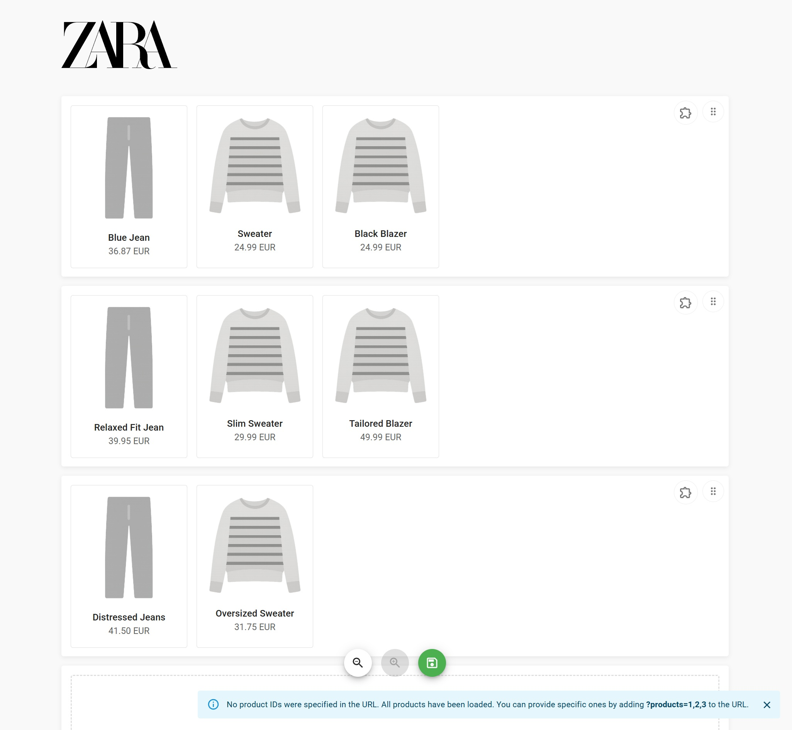

# Inditex - Caso Práctico Frontend Tools

Editor visual de productos y plantillas en una cuadrícula dinámica. Permite arrastrar y soltar productos, reorganizar filas, aplicar plantillas y guardar el resultado. Desarrollado con React, Zustand, Material UI y DnD Kit.

---

## Descripción Técnica

### Funcionalidades principales:

- ✅ Carga de productos (filtrados por query param `?products=1,2,...`)
- ✅ Agrupación automática por filas
- ✅ Reorganización de productos mediante drag and drop
- ✅ Aplicación de plantillas a cada fila
- ✅ Validaciones: cada fila debe tener al menos un producto y una plantilla
- ✅ Guardado de parrilla
- ✅ Zoom in / out sobre el grid
- ✅ Snackbar de feedback visual

---

## Estructura del proyecto

```
src/
├── domain/
│   ├── models/             # Tipos del dominio (Product, Template, ProductRow)
│   ├── datasources/        # Interfaces de datasource
│   └── repositories/       # Interfaces de repositorios
├── infraestructure/
│   ├── datasources/        # Implementación mock de datasource
│   ├── dtos/               # Estructuras que vienen del backend
│   ├── mappers/            # Transformadores DTO <-> Modelo
│   └── repositories/       # Implementación de repositorio
├── presentation/
│   ├── grid-editor/
│   │   ├── components/     # UI modular (Card, Row, Actions, etc.)
│   │   ├── hooks/          # Hooks para manejar lógica de negocio
│   │   ├── models/         # Modelos internos como DraftProductRow
│   │   ├── mappers/        # Mapper para guardar productos
│   │   └── pages/          # Página principal del editor
│   └── shared/             # Componentes y stores comunes
├── utils/                  # Utilidades
└── config/                 # Tema, mocks y constantes
```

---

## Instalación y ejecución

```bash
# Instalar dependencias
npm install

# Ejecutar en local
npm run dev

# Ejecutar tests
npm run test

# Ver cobertura de tests
npm run test:coverage
```

---

## Tests

- **Framework**: Vitest + Testing Library
- **Cobertura actual**:  
  - Lógica de negocio: ✅ 90-100%
  - Hooks personalizados: ✅ testeados individualmente
  - Componentes UI: testing EditorPage mockeado y un componente de UI (AddRowPlaceholder)
  - Reglas y validaciones (drag & drop, guardado): ✅

---

## Decisiones técnicas

- **Separación de responsabilidades**: se dividió `useGridEditor` en varios hooks (`useDragAndDrop`, `useSaveGrid`, `useRowsManager`, `useZoom`) para mayor claridad y testabilidad.
- **Repositorio centralizado**: uso de `createInditexRepository()` con inyección de dependencias para facilitar el testing.
- **Validaciones**: uso de snackbar para gestión de mensajes de error o de información.

---

## Pendientes / mejoras futuras

- Aplicar mejoras de accesibilidad
- Testear componentes UI

---

## Screenshots



---

##  Autor

> Proyecto técnico realizado por Arnau Folch, como parte del proceso técnico para Inditex.
